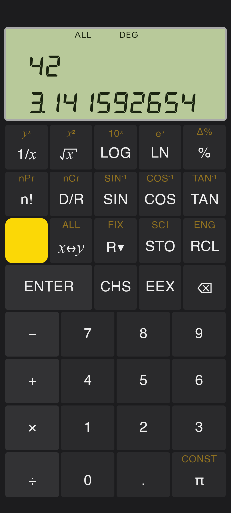

# RPN Calculator

An RPN calculator for Android, styled after the HP-41C, with a smattering of 12C and 35s. Written in Kotlin with Jetpack Compose.



## Why
The world does not need another calculator app. But I’m particular about calculators, and I was unhappy with what I could find on Google Play. Since software is essentially free now, I decided to make my own personal calculator, exactly the way I like it. It isn’t meant for anyone else. Every design choice reflects what I want. Very me‑centric.

The layout is similar to the HP‑41C, my favorite calculator, even if it’s not my everyday choice. I threw out all the programming features; if I need to write code, it won’t be on a calculator. It’s RPN because the neurons that do quick calculations were trained in the ’80s, when RPN was what I used. I put two layers of the stack on the screen because it helps to see both inputs to binary operations, but showing all four would just clutter.

Some possibilities opened up simply because this is an Android app. I added a swipe‑up gesture for ENTER. It’s my favorite new feature. it feels natural after only a few minutes, and it’s fast.

Copy/Paste. Just long press the display. Easy

The display transitions are animated, just because I could. ENTER moves the stack up. Roll‑down is down. Swap is just fun to watch.

I included the ALL format mode even though it was never on the 41C or 12C. But I like it, sometimes.

Instead of littering the keys with constants and conversions, I moved all of that to a menu. Another Android advantage.

I removed Grads. I’ve never used them once. Now Deg and Rad can share a single toggle key. Better.

I kept STO and RCL, but there are only ten memory registers, and they work like the 12C. There are no register‑math operations. Do your work on the stack.

What surprised me most was how difficult it is to format the display. Two‑thirds of the 250 tests are for display formatting. I threw away my first attempt because there was no reliable way to know whether another bug was hiding. So I switched to a state machine.

The font work was unexpected. I used one that looks like a seven‑segment display. I thought it would drop it, but I had to edit the with of the space character and had to create a comma. Curiously, the decimal point has zero width. That was new., but can't have the display getting wider because of punctuation.

The math was no trouble at all. I just pointed at a math library.

I’m still working on a good icon for the app.

I used Claude Opus 4.6 extensively, which is why software is essentially free.

The rest of this README is AI‑generated.


## Features

- **RPN stack** — 4-register stack (X, Y, Z, T) with roll, swap, and last-X
- **Display modes** — FIX, SCI, ENG, ALL with configurable decimal places
- **Seven-segment display** — modified DSEG7Classic font with zero-width decimal and comma glyphs for correct digit alignment
- **Digit grouping** — thousands separators (1,234,567.89) that don't consume display positions
- **Math operations** — arithmetic, powers, roots, logarithms, trig (sin/cos/tan + inverses), percentages, factorial, nCr, nPr, polar/rectangular conversion
- **Constants library** — built-in table of physical constants
- **Memory registers** — 10 registers (M0–M9) with STO/RCL
- **Swipe-up** anywhere for ENTER
- **State persistence** — stack, memory, display mode, and angle mode survive app kills and device restarts (DataStore)
- **In-app reset** — long-press backspace to reset all state (with confirmation)
- **Copy/paste** — long-press the display to copy X or paste a number from the clipboard

## Architecture

```
:logic          — pure Kotlin, no Android dependencies
  display/      — DisplayFormatter, positional SCI/ENG format
  engine/       — CalculatorEngine, state transitions
  entry/        — EntryStateMachine (Idle / Standard / Exponent states)
  math/         — MathOperations
  model/        — CalculatorState, Stack, EntryState, DisplaySettings

:app            — Android, Jetpack Compose
  ui/           — CalculatorViewModel, layouts, display panel, key grid
  data/         — DataStore persistence, constants repository
  di/           — Hilt bindings
```

All calculator logic is in `:logic` with no Android dependencies, making it testable with plain JVM unit tests. The `:app` module depends on `:logic`; the reverse is forbidden.

## Display format

The display has 12 character positions (0–11). Position 0 is always the sign slot (space or minus). Decimal points and commas are zero-width and do not consume positions.

| Mode | Format |
|------|--------|
| FIX N | Fixed decimal, N places; falls back to SCI if value won't fit |
| SCI N | Positional scientific: sign + significand (1+N digits) + padding + exp sign + 2 exp digits |
| ENG N | Same as SCI but exponent is always a multiple of 3 |
| ALL | Up to 10 significant digits, trailing zeros suppressed; falls back to SCI automatically |


## Build

```bash
./gradlew assembleDebug
```

Requirements: Android Studio Panda 4 (2025.3.4), minSdk 35 (Android 15).

## Tests

```bash
# All unit tests (logic + app)
./gradlew :logic:test :app:test

```


## Tech Stack

- Kotlin 2.2.10
- Jetpack Compose BOM 2026.02.01
- Hilt 2.59.2
- KSP 2.2.10-2.0.2
- Gradle 9.4.1 / AGP 9.2.1
- kotlinx.serialization (state persistence)
- DataStore Preferences (state persistence)
