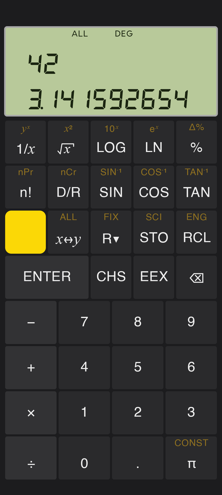

# RPN Calculator

[](https://github.com/brocla/RPN-calc/actions/workflows/test.yml)

An RPN calculator for Android, styled after the HP-41C, with a smattering of 12C and 35s. Written in Kotlin with Jetpack Compose.



## Why
The world does not need another calculator app. But I’m particular about calculators, and I was unhappy with what I could find for my phone. Since software is essentially free now, I decided to make my own personal calculator, exactly the way I like it. It wasn’t meant for anyone else, but it turned out that the Voice Input feature makes it ideal for people with hand tremors or other hand mobility issues. Sometimes, things work out like that.

The layout is similar to the HP‑41C, my favorite calculator, even if it’s not my everyday choice. I threw out all the programming features; if I need to write code, it won’t be on a calculator. It’s RPN because the neurons that do quick calculations were trained in the ’80s, when RPN was what I used. I put two levels of the stack on the screen because it helps to see both inputs to binary operations, but showing all four would just clutter.

Some possibilities opened up simply because this is an Android app. I added a swipe‑up gesture for ENTER. After a few tries, it becomes easier and quicker than clicking the ENTER key.

And I added Voice Input because I could. It has turned out to be the best thing about the app. That was a surprise to me. There is a microphone button to turn it on, but having to use a button to get to Voice mode seemed like a barrier to use. So Voice is also enabled by a two-finger swipe down. Perhaps I'll make a version where Voice is default ON. 

Other design decisions:

Copy/Paste. Just long press the display. Easy

The display transitions are animated, just because I could. ENTER moves the stack up. Roll‑down is down. Swap is just fun to watch.

I included the ALL format mode even though it was never on the 41C or 12C. But I like it, sometimes.

Instead of littering the keys with constants and conversions, I moved all of that to a menu. Another Android advantage.

I removed Grads. I’ve never used them once. Now Deg and Rad can share a single toggle key. Better.

I kept STO and RCL, but there are only ten memory registers, and they work like the 12C. There are no register‑math operations. Do your work on the stack.

What surprised me most was how difficult it is to format the display. Two‑thirds of the 250 tests are for display formatting. I threw away my first attempt because there was no reliable way to know whether another bug was hiding. So I switched to a state machine.

The font work was unexpected. I used a font that looks like a seven‑segment display. I thought it would drop in easily, but I had to edit the width of the space character and had to create a comma. 

The math was no trouble at all. I just pointed at a math library.

Another word about Voice Input. The native Speech-to-Text capability on Android wasn't a good fit. The android.speech.SpeechRecognizer does batch recognition and accesses the Google servers.  The app really needs streaming recognition and an on-device model. I got that from VOSK, an open source library. I improved the recognition by providing a list of the allowed words. There are only ~40. There were some irritating homophones like 'sign' and 'sine'. And some functions that sound like numbers, 10^x. But that got figured out. 'Help' is a keyword. It brings up a list of all the words in the grammar and what they do.


I used Claude Opus 4.6 extensively, which is why software is essentially free.

The rest of this README is AI‑generated.


## Features

- **Voice input** — speak operations and numbers; on-device recognition via Vosk, grammar-constrained to calculator vocabulary
- **RPN stack** — 4-register stack (X, Y, Z, T) with roll, swap, and last-X
- **Display modes** — FIX, SCI, ENG, ALL with configurable decimal places
- **Seven-segment display** — modified DSEG7Classic font with zero-width decimal and comma glyphs for correct digit alignment
- **Digit grouping** — thousands separators (1,234,567.89) that don't consume display positions
- **Math operations** — arithmetic, powers, roots, logarithms, trig (sin/cos/tan + inverses), percentages, factorial, nCr, nPr, polar/rectangular conversion
- **Constants library** — built-in table of physical constants
- **Memory registers** — 10 registers (M0–M9) with STO/RCL
- **Swipe-up** anywhere for ENTER
- **State persistence** — stack, memory, display mode, and angle mode survive app kills and device restarts (DataStore)
- **In-app reset** — long-press backspace to reset all state (with confirmation)
- **Copy/paste** — long-press the display to copy X or paste a number from the clipboard


## Architecture

```
:logic          — pure Kotlin, no Android dependencies
  display/      — DisplayFormatter, positional SCI/ENG format
  engine/       — CalculatorEngine, state transitions
  entry/        — EntryStateMachine (Idle / Standard / Exponent states)
  math/         — MathOperations
  model/        — CalculatorState, Stack, EntryState, DisplaySettings

:app            — Android, Jetpack Compose
  ui/           — CalculatorViewModel, layouts, display panel, key grid
  data/         — DataStore persistence, constants repository
  di/           — Hilt bindings
```

All calculator logic is in `:logic` with no Android dependencies, making it testable with plain JVM unit tests. The `:app` module depends on `:logic`; the reverse is forbidden.

## Display format

The display has 12 character positions (0–11). Position 0 is always the sign slot (space or minus). Decimal points and commas are zero-width and do not consume positions.

| Mode | Format |
|------|--------|
| FIX N | Fixed decimal, N places; falls back to SCI if value won't fit |
| SCI N | Positional scientific: sign + significand (1+N digits) + padding + exp sign + 2 exp digits |
| ENG N | Same as SCI but exponent is always a multiple of 3 |
| ALL | Up to 10 significant digits, trailing zeros suppressed; falls back to SCI automatically |


## Voice Input

Say calculator operations out loud. Recognition runs entirely on-device using [Vosk](https://alphacephei.com/vosk/) — no audio ever leaves the phone.

### Activation

| Action | Effect |
|--------|--------|
| Tap mic key (row 8, col 4) | Toggle voice on / off |
| Two-finger swipe down on keypad | Start voice |
| Two-finger swipe up on keypad | Stop voice |

An ascending chime (C5→E5) plays when listening starts; a descending chime (E5→C5) plays when it stops. The screen stays on while listening and for 30 seconds after the last word heard.

### Speaking commands

RPN is naturally suited to voice — say numbers and operations in the same order you would press keys:

```
"three enter five plus"       → pushes 3, pushes 5, adds → 8
"one seven reciprocal"        → pushes 17, computes 1/17
"fix two"                     → sets display to FIX 2
"store three"                 → stores X into register 3
```

A grammar constraint limits recognition to calculator vocabulary, which reduces misrecognition from background noise. Non-obvious word mappings are listed in the in-app voice help sheet (say "help" or long-press the mic key).

### Model

The app uses `vosk-model-small-en-us-0.15`. Place the unpacked model folder at:

```
app/src/main/assets/model-en-us/
```

The expected model name is tracked in [`app/src/main/assets/model-en-us/uuid`](app/src/main/assets/model-en-us/uuid). The binary files are excluded from the repository.

## Build

```bash
./gradlew assembleDebug
```

Requirements: Android Studio Panda 4 (2025.3.4), minSdk 35 (Android 15).

## Tests

```bash
# All unit tests (logic + app)
./gradlew :logic:test :app:test

```


## Tech Stack

- Kotlin 2.2.10
- Jetpack Compose BOM 2026.02.01
- Hilt 2.59.2
- KSP 2.2.10-2.0.2
- Gradle 9.4.1 / AGP 9.2.1
- kotlinx.serialization (state persistence)
- DataStore Preferences (state persistence)
- Vosk after 0.3.75 (offline speech recognition)

vosk-android 0.3.75 is used **with a local workaround** `(SpeechServiceExt.kt)` because `SpeechService.getAudioSessionId()` was not yet released when this was written. It was merged in [alphacep/vosk-api@e81a422](https://github.com/alphacep/vosk-api/commit/e81a422) (PR #2042). Once a version **after 0.3.75** is published to Maven Central that includes that commit, remove `SpeechServiceExt.kt` and replace `it.audioSessionId()` calls with `it.audioSessionId` in `VoskVoiceInputController.kt`.
